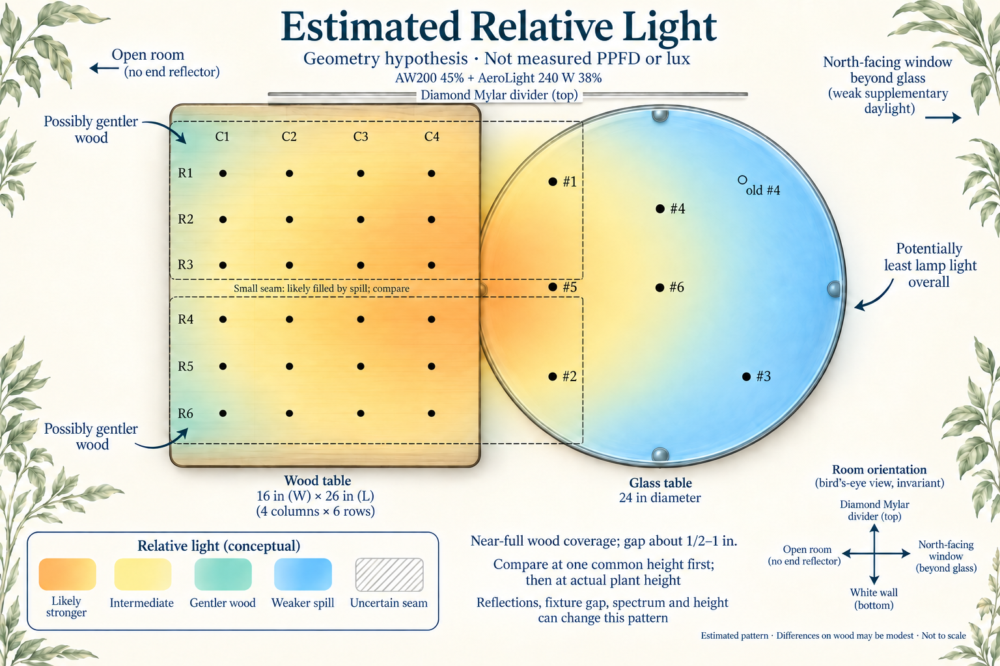
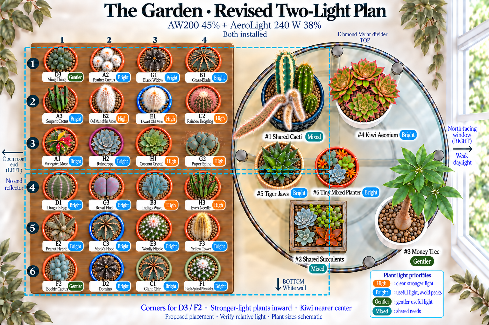
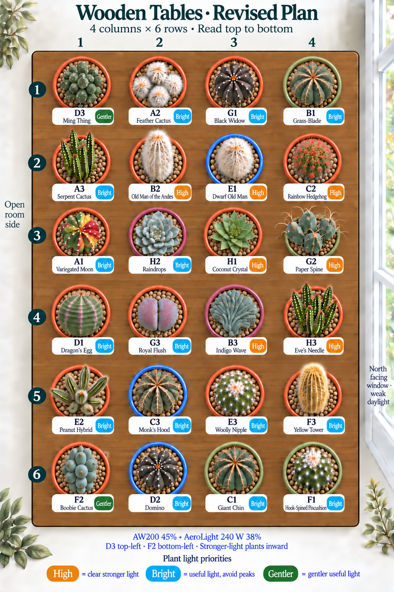
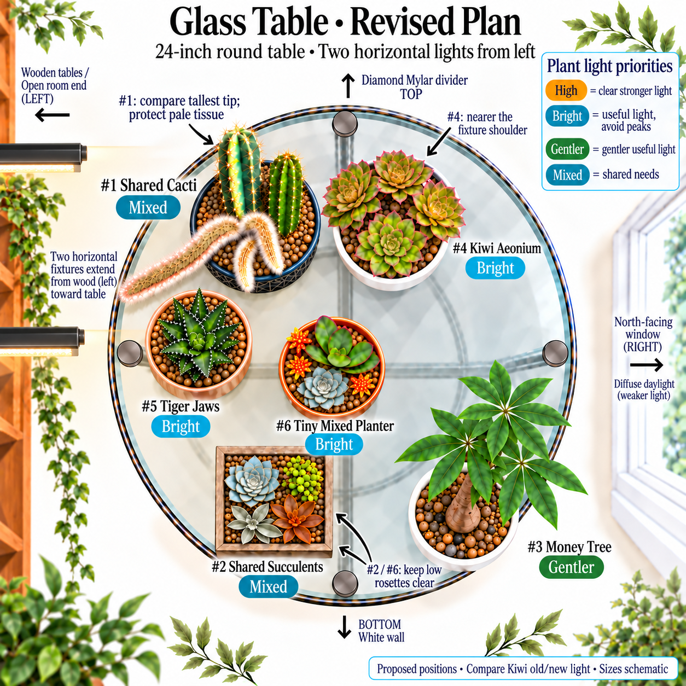

# Table Placement Guide

The September 14 relative-light revision proposes gentler wooden corners for D3 Ming Thing and F2 Boobie, clearer interior positions for stronger-light priorities, and an inward shoulder for Kiwi aeonium. It supersedes the earlier F2/E3-only refinement and optional A1/C2 swap. These are recommended destinations, not a record that the owner has already moved the pots or measured their light.

The **AW200 at 45%** and **AeroLight 240 W at 38%** are installed as two horizontal fixtures. Both long axes run left/open room to right/glass, one over the upper wooden half and the other over the lower half. The owner-reported **18-inch plant-tip reference** and shared **13 h 15 m total cycle**, including **15 m sunrise and 15 m sunset**, remain the operating record. The room-facing end stays open.

## Estimated Relative Light

This is a **qualitative hypothesis**, not a calculated light simulation, a calibrated heat map, or a map of adequate versus inadequate light. The color difference across the wood may be modest. Fixture outlines show approximate body placement; they are not light boundaries. The far-right glass is a more plausible low-light area than either wooden corner.

| Area                                                                 | Expected Relative Pattern                                                                                       | Placement Implication                                                              |
| -------------------------------------------------------------------- | --------------------------------------------------------------------------------------------------------------- | ---------------------------------------------------------------------------------- |
| R1C1 and R6C1, the two open-left wooden corners                      | Plausibly gentler than the interior because each is near two outer edges; still directly lit                    | Favor D3 and F2 here, without calling the corners shade                            |
| Middle of the open-left column                                       | Potentially brighter than the corners because both nearby panels contribute; no end reflector                   | A useful bright shoulder for A1, A3, D1, and E2                                    |
| Inner/right wood, especially C3–C4 around R2–R5, and near-left glass | Candidate for somewhat stronger combined exposure, depending on diode pattern and height                        | Prioritize clear light for C2, B3, H1, and other stronger-light plants             |
| Join between rows 3 and 4                                            | With only a ½–1-inch fixture gap, spill probably fills across it; exact overlap or variation remains unmeasured | Compare it, but do not create a dark stripe or assume a maximum-intensity strip    |
| Top and bottom shoulders                                             | Near the outer panel edges, but Mylar/top and white wall/bottom may return light                                | Not necessarily equal; do not rank them precisely from the drawing                 |
| Far-right glass rim                                                  | Likely weaker lamp spill; the north-facing window adds limited daylight                                         | Retain money tree in useful outer spill; bring Kiwi closer to the fixture shoulder |

An extended panel with fan openings does not necessarily peak at its exact geometric center. Reflectors, fixture spacing, spectrum, and foliage shadows can alter the ranking. Low rosettes and tall cactus tips also occupy different light planes. The [complete review](../two-light-placement-review.md) preserves plant-specific evidence and identification limits.

## Proposed Changes and Space Audit

Ten wooden coordinates change from the preceding September 14 illustration; fourteen stay. Only Kiwi changes broad position on glass. The purpose is to allocate the likely gentler and stronger positions sensibly, not to claim that ten plants are currently receiving unsuitable light. Near-full coverage means some moves may make little measurable difference.

| Group                    | Proposed Moves                                                           | Reason                                                                                                    |
| ------------------------ | ------------------------------------------------------------------------ | --------------------------------------------------------------------------------------------------------- |
| Gentler lower corner     | F2 R5C1 → R6C1; E2 R6C1 → R5C1                                           | Give Boobie the second open-left corner; retain useful light for the peanut hybrid                        |
| Upper and left shoulders | A1 R1C3 → R3C1; C2 R3C1 → R2C4; B1 R2C4 → R1C4; G1 R1C4 → R1C3           | Favor a clear interior position for Rainbow Hedgehog while retaining bright positions for the other three |
| Lower interior           | B3 R4C1 → R4C3; D1 R4C3 → R4C1                                           | Give Indigo Wave stronger-light priority; a probable Euphorbia hybrid need not occupy the strongest slot  |
| Low rosettes             | H1 R3C2 → R3C3; H2 R3C3 → R3C2                                           | Prioritize clear stronger exposure for Coconut Crystal; give Raindrops a bright shoulder                  |
| Glass                    | #4 Kiwi: far upper-right → upper-middle, nearer the fixture-end shoulder | Preserve substantial lamp contribution instead of relying on the weak north window                        |

This supersedes the old optional A1/C2 swap: **C2 now goes to R2C4, not R1C3**. E3 remains R5C3 from the earlier refinement, and D3 remains R1C1.

- **Fit:** the wood remains four columns by six rows. Most recorded pots are 4-inch class; F2 is 3-inch. Moving 4-inch E2 into row 5 in place of 3-inch F2 tightens that row relative to the preceding plan. Four 4-inch rims already span the nominal 16-inch width. Actual rims, rails, bases, and foliage must fit with bases supported; the drawing cannot certify this.
- **Low-plant shadows:** H1's new neighbors include E1 above, B3 below, and G2 beside it. Give the rosette a clear light path; do not insist on the exact center of a cell if foliage blocks it. H2, G3, #5, #6, and the Echeveria in #2 need the same consideration.
- **Glass fit:** shift Kiwi only as far inward as its base and canopy allow without crowding #1 or shading #6. Do not push the low dish or square box to the weak outer rim to make the picture fit. Current dimensions of the large shared pots remain unmeasured.
- **Fixtures:** retain their horizontal axes, current dimmers, leveled suspension, and reported clearance for the first comparison. A broad mismatch may justify recentering the affected fixture after measurement; raising both dimmers to compensate for one outer pot is not the first step.
- **Care records:** a placement move is not a repot, new pot setup, watering event, or automatic daily-weighing trigger. Preserve existing wet/dry references and learn any changed drying behavior from actual observations.

## The Current Arrangement at a Glance

The illustrations use plain-language **exposure priorities**, not measured intensity bands. “High” means preserve clear strong light; “Bright” means useful light while avoiding excessive peaks; “Gentler” means a bright outer position; “Mixed” means consider the components of one shared pot. These priorities overlap: a Bright plant may tolerate sun, and a High plant can still be overexposed. A directly lit edge is not literally filtered or indirect light.

## Light Priorities and Recommended Spots

| Priority             | Pots                                                                   | Practical Placement                                                                                                                                                                                                                                                                                                                              |
| -------------------- | ---------------------------------------------------------------------- | ------------------------------------------------------------------------------------------------------------------------------------------------------------------------------------------------------------------------------------------------------------------------------------------------------------------------------------------------ |
| **High — 7 pots**    | B2, B3, C2, E1, G2, H1, H3                                             | Favor clear interior exposure for C2 at R2C4, B3 at R4C3, and H1 at R3C3; keep the other stronger-light priorities clearly lit. Use actual exposure rather than assuming every center or seam is brightest. E1's identity and exact light response remain qualified; small B3 needs care despite stronger-light tolerance in established growth. |
| **Bright — 18 pots** | A1, A2, A3, B1, C1, C3, D1, D2, E2, E3, F1, F3, G1, G3, H2; #4, #5, #6 | Preserve useful light, with Kiwi nearer the upper-middle glass shoulder. Raindrops, Royal Flush, Dragon's Egg, and the low glass plants do not need a maximum-intensity slot. A1 and Black Widow are not automatically shade plants because they are variegated.                                                                                 |
| **Gentler — 3 pots** | D3 Ming Thing, F2 Boobie, #3 Money Tree                                | D3 at R1C1, F2 at R6C1, and #3 on outer/lower-right glass. The likely gentler exposure remains unmeasured; small F2's priority is a prudent collection choice, not a lifetime shade requirement.                                                                                                                                                 |
| **Mixed — 2 pots**   | #1 Shared Cacti; #2 Square Wooden Succulent Box                        | Preserve useful light for each component, protect the pale column from excessive exposure, and keep low rosettes out of taller foliage shadows. The Kalanchoes can share bright light with the rest of #2.                                                                                                                                       |

These counts cover the 24 wooden pots and six glass containers exactly once. Shared components do not become separate pots or weigh-ins. See the [watering strategy](../watering-strategy.md) and [weighing strategy](../weighing-strategy.md) for how environmental changes affect interpretation of observations.

## Two Lights, Coverage, and Mounting

The owner clarified that the fixtures cover almost the entire wooden area, with roughly an inch left at the top and bottom ends in the marked-up view and only a **½–1-inch gap between fixtures**. Treat those as approximate owner observations, not dimensions from a measured plan. At the reported height, substantial spill across this narrow gap is expected; a dark seam is unlikely from the gap alone. The AW200 wings are assumed to remain flat. The upper/lower model assignment and current spectrum modes remain unconfirmed.

Each approximately **26-inch long fixture axis runs left-to-right** across the wood toward the near half of glass. The model assigned to the upper versus lower position has not been confirmed. The outlines show direction and intended reach, not a measured beam boundary or exact fixture centers.

Across the arrangement, about 26 inches of fixture length compares with 16 inches of wood plus 12 inches of near glass before furniture gaps. The two short fixture dimensions total about 25.9 inches before the fixture gap, alongside about 26 inches of wooden depth. These physical dimensions do not establish uniform coverage. A tall shared cactus tip and a low rosette can receive quite different exposure.

Keep **AW200 45% and AeroLight 240 W 38%** for the first relative-light comparison. Both retain the same **13 h 15 m total cycle**, with the two 15-minute transitions included. Each light has independent suspension from two ceiling hooks. The left two-foot return reflector remains removed; top Mylar and bottom white wall remain. The [equipment record](../equipment/aw200-and-aerolight-240w.md) distinguishes manufacturer specifications from owner observations.

## Current Room and Installed Lights

| Item                      | Recorded Setup or Plan                                                                                                                                                 |
| ------------------------- | ---------------------------------------------------------------------------------------------------------------------------------------------------------------------- |
| Installed pair            | **AW200 + AeroLight 240 W (VSL-AL240)**, hung and further leveled **September 13**                                                                                     |
| Fixture size and position | AW200 **26 × 13 × 2.1 in**; new 240 W **25.9 × 12.9 × 2.1 in**. Long axes left-to-right, one above the other; exact centers unmeasured; owner estimates a ½–1-inch gap |
| Reported settings         | **AW200 45% · AeroLight 240 W 38%**                                                                                                                                    |
| Daily program             | Both share **13 h 15 m total**, including **15 m sunrise + 15 m sunset**                                                                                               |
| Right                     | **North-facing window**, beyond glass; weak supplementary daylight                                                                                                     |
| Top                       | Existing Diamond Mylar divider retained                                                                                                                                |
| Bottom                    | White wall retained                                                                                                                                                    |
| Left                      | **Open room-facing end**; approximately two-foot Mylar return panel removed from the plan                                                                              |
| Wooden tables             | Two **16 × 13-inch** tops, each **18 inches high**; four columns and six rows, join after row 3                                                                        |
| Glass table               | **24-inch diameter**, round, **18 inches high**                                                                                                                        |
| Plant-tip reference       | Owner-reported **18 inches (45.7 cm)**; individual tip distances and light levels are not mapped                                                                       |

Two 13-inch depths joined give a nominal **16-inch-wide × 26-inch-long** wooden
rectangle. This is not a fresh usable-surface measurement. Four 4-inch rims
already span 16 inches, so verify rims, rails, and foliage when placing pots.
The [two-light equipment note](../equipment/aw200-and-aerolight-240w.md) separates
manufacturer specifications from the earlier AW200SE and superseded AW400 records. Old light
maps and dimming percentages are not measurements of the new open-end setup.

## Wooden Tables: Proposed Four-Column, Six-Row Layout

Rows run **top/Mylar to bottom/white wall**. Columns run **left/open room end
to right/glass table**. R3C2 means row 3, column 2; every row below is one
horizontal row in the image. The column names carry no brightness ranking.

| Row            | C1 · Open Room                | C2                               | C3                          | C4 · Toward Glass                    |
| -------------- | ----------------------------- | -------------------------------- | --------------------------- | ------------------------------------ |
| 1 · Mylar      | D3 · Ming Thing · Gentler     | A2 · Feather Cactus · Bright     | G1 · Black Widow · Bright   | B1 · Grass-Blade · Bright            |
| 2              | A3 · Serpent · Bright         | B2 · Old Man of the Andes · High | E1 · Dwarf Old Man · High   | C2 · Rainbow Hedgehog · High         |
| 3              | A1 · Variegated Moon · Bright | H2 · Raindrops · Bright          | H1 · Coconut Crystal · High | G2 · Paper Spine · High              |
| 4              | D1 · Dragon's Egg · Bright    | G3 · Royal Flush · Bright        | B3 · Indigo Wave · High     | H3 · Eve's Needle · High             |
| 5              | E2 · Peanut Hybrid · Bright   | C3 · Monk's Hood · Bright        | E3 · Woolly Nipple · Bright | F3 · Yellow Tower · Bright           |
| 6 · White wall | F2 · Boobie · Gentler         | D2 · Domino · Bright             | C1 · Giant Chin · Bright    | F1 · Hook-Spined Pincushion · Bright |

These are proposed final destinations. They do not assert a completed physical move, measured adequacy, or an acclimation schedule. Small size alone does not establish F2's developmental age.

## Every Wooden-Table Plant Reviewed

These are the best-supported ongoing needs for the current plants. A genus
comparison or an uncertain identification is marked as such; a badge does not
turn it into a confirmed species-specific requirement.

| Label | Plant and Retained Identification                                                                                                       | Light Need · Proposed Spot · Evidence                                                                                                                                                                                                                  |
| ----- | --------------------------------------------------------------------------------------------------------------------------------------- | ------------------------------------------------------------------------------------------------------------------------------------------------------------------------------------------------------------------------------------------------------ |
| A1    | [Variegated moon cactus](../plants/starter/gymnocalycium-mihanovichii-variegated.md) · _Gymnocalycium mihanovichii_                     | **Bright · R3C1.** Move to the bright open-left middle shoulder. This rooted, chlorophyll-bearing selection needs useful light; the move is not grafted-moon shade advice. Evidence: [Costa Farms' exact rooted selection][rooted-moon].               |
| A2    | [Feather cactus](../plants/starter/mammillaria-plumosa.md) · _Mammillaria plumosa_                                                      | **Bright · R1C2.** Retain the upper shoulder with useful bright light. Its white covering does not establish a need for maximum exposure. Evidence: [RHS][feather].                                                                                    |
| A3    | [Serpent cactus](../plants/starter/nyctocereus-serpentinus.md) · _Nyctocereus serpentinus_                                              | **Bright · R2C1.** Retain the open-left shoulder. Columnar form alone is not a reason to force it into the strongest area. Evidence: [LLIFLE][serpent].                                                                                                |
| B1    | [Grass-blade cactus](../plants/starter/stenocactus-phyllacanthus.md) · _Stenocactus phyllacanthus_                                      | **Bright · R1C4.** Move one row up into the upper-right shoulder. Keep clear bright exposure; the wood-to-glass boundary is still beneath the fixtures.                                                                                                |
| B2    | [Old Man of the Andes](../plants/starter/oreocereus-trollii.md) · _Oreocereus trollii_                                                  | **High · R2C2.** Retain clear upper-interior exposure. Compare the real growing tip, not just the table surface. Evidence: [NParks][oreocereus].                                                                                                       |
| B3    | [Indigo Wave](../plants/starter/myrtillocactus-geometrizans-indigo-wave.md) · _Myrtillocactus geometrizans_ 'Indigo Wave'               | **High · R4C3.** Move inward to the lower interior. Stronger-light guidance for established Myrtillocactus supports this priority, but this small crest is not a mature landscape column. Evidence: [Myrtillocactus guidance][myrtillocactus].         |
| C1    | [Giant chin](../plants/starter/gymnocalycium-saglionis.md) · _Gymnocalycium saglionis_                                                  | **Bright · R6C3.** Retain a bright lower position. Gymnocalycium species do not all share one shade requirement. Evidence: [LLIFLE][giant-chin].                                                                                                       |
| C2    | [Rainbow hedgehog](../plants/starter/echinocereus-rigidissimus-rubispinus.md) · _Echinocereus rigidissimus_ subsp. _rubispinus_         | **High · R2C4.** Move inward to the upper-right interior, away from the central join. Its sun-loving evidence makes it a stronger-light priority; the left edge is not proven inadequate. Evidence: [RHS][rainbow].                                    |
| C3    | [Monk's hood](../plants/starter/astrophytum-ornatum.md) · _Astrophytum ornatum_                                                         | **Bright · R5C2.** Retain a bright lower shoulder. Its neighbors are now E2 and E3; RHS under-glass guidance does not require the highest available intensity. Evidence: [RHS][monks-hood].                                                            |
| D1    | [Dragon's Egg](../plants/starter/euphorbia-obesa-hybrid.md) · probable _Euphorbia obesa_-type hybrid or selection                       | **Bright · R4C1.** Move to the open-left middle shoulder. Preserve useful bright light without assigning a maximum-light requirement to this probable Euphorbia obesa-type hybrid. Evidence: [SANBI][obesa].                                           |
| D2    | [Domino](../plants/starter/echinopsis-subdenudata.md) · _Echinopsis subdenudata_                                                        | **Bright · R6C2.** Retain a bright lower shoulder. Comparative semi-shade guidance supports avoiding an excessive peak. Evidence: [NParks][domino].                                                                                                    |
| D3    | [Ming Thing](../plants/starter/cereus-forbesii-ming-thing.md) · _Cereus forbesii_ 'Ming Thing'                                          | **Gentler · R1C1.** Retain the top-left corner, a plausible gentler wooden position. The corner remains lit and its actual intensity is unmeasured. Evidence: [NC State][ming].                                                                        |
| E1    | [Dwarf old man](../plants/cacti/espostoa-melanostele-nana.md) · _Espostoa_ sp., likely _E. melanostele_ subsp. _nana_                   | **High · R2C3.** Retain the upper interior. Preserve the qualified Espostoa identification and keep its actual height from shading the low H1 rosette.                                                                                                 |
| E2    | [Peanut hybrid](../plants/cacti/chamaelobivia-hybrid.md) · _Echinopsis_ hybrid, Chamaelobivia Group                                     | **Bright · R5C1.** Move one row up along the bright left shoulder, releasing the bottom-left corner for F2. Unknown hybrid parentage limits exact light claims.                                                                                        |
| E3    | [Woolly nipple](../plants/cacti/mammillaria-mammillaris.md) · probable _Mammillaria mammillaris_                                        | **Bright · R5C3.** Retain R5C3 from the earlier refinement. Preserve clear bright exposure and the probable Mammillaria identification. Evidence: [NC State Mammillaria guidance][mammillaria].                                                        |
| F1    | [Hook-spined pincushion](../plants/cacti/mammillaria-rekoi.md) · _Mammillaria_ cf. _rekoi_                                              | **Bright · R6C4.** Retain clear bright exposure at the lower-right position. Keep the cf. rekoi and alternative crinita-complex or hybrid qualifiers. Evidence: [Mammillaria guidance][mammillaria].                                                   |
| F2    | [Boobie cactus](../plants/cacti/myrtillocactus-geometrizans-fukurokuryuzinboku.md) · _Myrtillocactus geometrizans_ 'Fukurokuryuzinboku' | **Gentler · R6C1.** Move to the bottom-left corner, the second plausible gentler wooden position. Its recorded 3-inch pot is not proof of juvenile age or a permanent shade requirement. Evidence: [Cultivar guidance][boobie].                        |
| F3    | [Yellow tower](../plants/cacti/parodia-leninghausii.md) · _Parodia leninghausii_                                                        | **Bright · R5C4.** Retain the bright lower-right position. A taller tip may receive more light than nearby low plants despite the same row.                                                                                                            |
| G1    | [Black Widow](../plants/cacti/gymnocalycium-mihanovichii-black-widow.md) · _Gymnocalycium mihanovichii_ f. variegata 'Black Widow'      | **Bright · R1C3.** Move one column left along the upper shoulder. Keep substantial bright light; variegation does not automatically imply shade. Evidence: [exact grower][black-widow].                                                                |
| G2    | [Paper spine](../plants/cacti/tephrocactus-articulatus-papyracanthus.md) · _Tephrocactus articulatus_ var. _papyracanthus_              | **High · R3C4.** Retain clear inner-right exposure. Compare the narrow fixture join and avoid shadows from the tall shared cactus pot. Evidence: [Paper-spine guidance][paper-spine].                                                                  |
| G3    | [Royal Flush split rock](../plants/succulents/pleiospilos-nelii-royal-flush.md) · _Pleiospilos nelii_ 'Royal Flush'                     | **Bright · R4C2.** Retain a clear lower-interior shoulder at its low growing surface. Preserve Royal Flush watering exceptions; brighter placement does not permit extra watering. Evidence: [SANBI][split-rock].                                      |
| H1    | [Coconut Crystal](../plants/succulents/sempervivum-coconut-crystal.md) · _Sempervivum_ Colorockz® 'Coconut Crystal'                     | **High · R3C3.** Move one column inward to give the low rosette priority for clear stronger exposure. Check shadows from E1 above, B3 below, and G2 beside it; strong light does not mean maximum heat. Evidence: [Sempervivum guidance][sempervivum]. |
| H2    | [Raindrops](../plants/succulents/echeveria-raindrops.md) · _Echeveria_ 'Raindrops'                                                      | **Bright · R3C2.** Move one column left to a bright inner shoulder. Exact grower guidance supports useful bright light without claiming the strongest slot. Evidence: [The exact Raindrops grower][raindrops].                                         |
| H3    | [Eve's needle](../plants/cacti/austrocylindropuntia-subulata.md) · _Austrocylindropuntia subulata_                                      | **High · R4C4.** Retain the lower-right interior. Keep upright growth from shading B3, G2, H1, or the low glass planters. Evidence: [NC State][eves-needle].                                                                                           |

## Glass Table: Proposed Positions, Shapes, and Sizes

The **table** is 24 inches across, not the largest planter. Shapes come from the
owner's August 29 and September 1–2 photographs in the
[photo manifest](../../assets/collection-photos/photo-manifest.json), plus current
profiles. Rim widths are not canopy widths; the illustration does not certify fit.

| Label / Tracker | Container and Recorded Size                                                                                                                                         | Proposed Spot and Light Need                                                                                   |
| --------------- | ------------------------------------------------------------------------------------------------------------------------------------------------------------------- | -------------------------------------------------------------------------------------------------------------- |
| #1 / P19        | **Round dark planter with a pale leaf pattern**; diameter and height unmeasured. The old 12.5–13-inch record is plant tip **above the tabletop**, not pot diameter. | **Mixed · upper-left**; green stems toward the clear lamp path, pale tissue toward the less exposed side.      |
| #2 / P20        | **Square wooden box**, weathered gray-brown sides; side length, height, and liner/drainage details unmeasured.                                                      | **Mixed · lower-left**; the Echeveria side faces the clearer lamp path on the near half.                       |
| #3 / P21        | **White round plastic pot**, single thick money-tree trunk; current **6-inch class** Amazon Basics pot. The stored 8-inch pot is not installed.                     | **Gentler · lower-right**; bright indirect spill outside the stronger cactus overlap.                          |
| #4 / P22        | **White round pot**, branched Kiwi aeonium; approximately **5-inch pot** in the acquisition record, current rim/canopy dimensions unmeasured.                       | **Bright · upper-middle**; move inward toward the fixture-end shoulder, with canopy space.                     |
| #5 / P29        | **Tan round pot with horizontal ribs** after repotting; current dimensions unmeasured. The **2.5-inch retail label is the old arrival container**.                  | **Bright · just left of center**; inside the planned near-half coverage, with open light above the low leaves. |
| #6 / P30        | **Small round terracotta deep dish**; **five-inch class** seller record, not a fresh rim or height measurement.                                                     | **Bright · left-center gap** between #1 and #2, retained from September 13.                                    |

### Component Plants and Their Light Needs

- **#1 · Shared Cacti — Mixed:** [probable variegated Pilosocereus pachycladus](../plants/rehab/pilosocereus-pachycladus-variegated.md), [Cleistocactus colademononis](../plants/rehab/cleistocactus-colademononis.md), and [probable Echinopsis spachiana](../plants/rehab/echinopsis-spachiana.md) remain together. Give the green stems clear light and avoid excessive exposure on the pale column. Its tallest tip may need a different clearance from low plants; rotating a uniformly overhead-lit pot does not automatically protect the pale tissue. The historical removed probable Mammillaria bombycina remains excluded.
- **#2 · Square Wooden Succulent Box — Mixed:** retain [probable Echeveria pulidonis or close hybrid](../plants/succulents/echeveria-pulidonis.md), [Portulacaria afra](../plants/succulents/portulacaria-afra.md), [probable Kalanchoe bracteata](../plants/succulents/kalanchoe-bracteata.md), and [Kalanchoe orgyalis](../plants/succulents/kalanchoe-orgyalis.md). Keep the low Echeveria out of taller foliage shadows. The Kalanchoes tolerate a range from sun to partial shade; their presence does not require a dark half of the box. The possible golden Portulacaria cultivar remains unconfirmed.
- **#3 · Money Tree — Gentler:** the working [Pachira glabra](../plants/houseplants/pachira-glabra.md) retains useful gentler lamp spill on outer glass. [P. aquatica guidance][money-tree] is a care comparison, not identification proof.
- **#4 · Kiwi Aeonium — Bright:** move [Aeonium haworthii 'Dream Color'](../plants/succulents/aeonium-haworthii-dream-color.md) from the far upper-right toward the upper-middle fixture shoulder. Preserve clear light for #1 and #6. [Wisconsin Extension][aeonium] supports substantial indoor light; a weak north window alone is not assumed sufficient. Compare its old and new spots at the same canopy height.
- **#5 · Tiger Jaws — Bright:** [probable Faucaria tuberculosa](../plants/succulents/faucaria-tuberculosa.md) remains seller-labeled F. tigrina. [SANBI][tiger-jaws] is a comparison, not proof of species or a need for the strongest intensity.
- **#6 · Tiny Mixed Planter — Bright:** keep the [small terracotta dish](../plants/succulents/tiny-mixed-succulent-planter.md) clear of shadows. The provisional Echeveria rosettes, Sedum adolphi/nussbaumerianum complex, and Kalanchoe luciae/thyrsiflora complex remain one tracked pot with unconfirmed component identities.

The [complete review](../two-light-placement-review.md) gives the source-by-source reasoning for each component. Five broad glass positions are retained; Kiwi moves inward in the proposal. The illustrations do not claim new pot dimensions or completion of a move.

## Compare the Plan With a Phone Meter

Your phone can help test the **relative pattern**, provided readings repeat reasonably under the same conditions. It cannot establish an absolute plant-light target here. Lux is illuminance, not lumens; conversion to PPFD depends on spectrum. The two fixtures can mix different spectra across the display, so even a repeatable lux ratio is only an approximate comparison of plant-useful light, not a PPFD ratio. See [Apogee's source-dependent conversion examples](https://www.apogeeinstruments.com/conversion-ppfd-to-lux/) and [University of Minnesota Extension's lighting guidance](https://extension.umn.edu/garden-and-home/yard-and-garden/gardening-in-minnesota/lighting-for-indoor-plants).

Use the [blank reading sheet](../../assets/layouts/2026-09-14-relative-light/relative-readings.csv) or send the readings as six rows of four numbers plus the glass points. This is a one-time comparison, not another daily chore.

1. Run **AW200 45% and AeroLight 240 W 38% at their steady setting**, outside the sunrise/sunset ramps. Record each spectrum mode and which fixture is on the upper/Mylar side. Keep blinds/daylight consistent, ideally with little daylight contribution.
2. Use the same phone, app, sensor orientation, and any diffuser the app specifically requires. Identify its active sensor, point it consistently upward, avoid shading it with your body, and let the value settle. Repeat a few readings. If the app clips at a maximum or varies wildly without moving, it cannot reliably rank those spots.
3. First compare the 24 wooden points and six glass points at **one common horizontal height**. Choose a safe clear plane above obstructions if necessary, record that height, and keep it the same. This isolates position better than mixing tall tips with low rosettes. It does not measure every plant's actual exposure.
4. Re-read **R2C3 at that same height** before, during, and after the pass. If the reference drifts more than normal repeat-to-repeat variation, recheck the affected group under steadier conditions. Do not combine incomparable passes.
5. Make a shorter second pass at **actual growing-surface height** for D3, F2, A1, C2, B3, H1, H2, G3, #5, #6, the pale and green tips in #1, #3, and #4. Record those heights separately. Compare the old and proposed Kiwi spots at the same Kiwi canopy height.
6. Keep the two passes separate. Send raw app values and units, not a guessed PPFD conversion. Optional comparisons against the repeated reference are relative brightness ratios only. If spectrum modes differ, rankings across the two halves deserve extra caution.

| Result                                                        | How It Changes the Plan                                                                                             |
| ------------------------------------------------------------- | ------------------------------------------------------------------------------------------------------------------- |
| Corners are slightly gentler and the interior is broadly even | Keep the proposed priorities; there is no reason to chase tiny slot differences                                     |
| A supposed gentler corner reads as bright as the interior     | Treat the benefit of that move as uncertain; use another demonstrably gentler lit position or a suitable clearance  |
| The small join has a clear dip or peak                        | Give stronger-light priorities a clear nearby position; avoid reserving a measured peak for sensitive plants        |
| Kiwi's inward spot is appreciably brighter at the same height | The inward move has support, provided it does not shade low neighbors                                               |
| Low rosettes read dim while tall tips read bright             | Investigate canopy shadows and height differences before increasing the whole display                               |
| Almost all wooden values repeat within a small range          | The coverage is relatively even at that plane; preserve fit and plant spacing instead of reshuffling to chase noise |

No reading has been entered into the template. If the measured ranking contradicts the illustration, **the repeatable measurements take precedence**. Relative uniformity alone still cannot establish whether the whole display is too bright or too dim.

## Sources

- **Equipment:** [AW200 manual][aw200], [new AeroLight manual][aerolight-240],
  and [240 W product page][aerolight-product] for model-specific dimensions,
  weights, power, and controls. The [equipment note](../equipment/aw200-and-aerolight-240w.md)
  records the four-hook mounting plan and open room-facing end.

The September 13 installation, further leveling after the photographs,
AW200 45% and AeroLight 240 W 38% settings, applied plant layout, 18-inch
plant-tip reference, and shared 13 h 15 m cycle including 15-minute sunrise
and sunset transitions are
owner evidence. The later marked-up plan corrects both fixture long axes to
left-to-right, one above the other. The four-hook plan, reflector removal, room
orientation, and container shapes are also owner evidence. The guidance
distinguishes species evidence, genus comparisons, grower claims, and placement
inference. The September 14 relative-light revision proposes the new coordinate grid and Kiwi move. The owner's latest sketch reports near-full wooden coverage, approximately one-inch outer top/bottom margins, and a ½–1-inch fixture gap; these approximate observations do not form a measured scale drawing. Installation remains dated September 13.

- **Primary cactus guidance:** [RHS general care][general],
  [RHS rainbow hedgehog][rainbow], [NParks Old Man of the Andes][oreocereus],
  [RHS feather cactus][feather], [RHS monk's hood][monks-hood],
  [NParks Domino][domino], [NC State Ming Thing][ming],
  [NC State Mammillaria][mammillaria], [NC State Eve's needle][eves-needle],
  [SANBI split rock][split-rock], and [SANBI Euphorbia obesa][obesa].
- **Rosettes and shared-pot comparisons:** [NC State Echeveria][echeveria],
  [NC State Sempervivum][sempervivum], [RHS Echeveria pulidonis][pulidonis],
  [RHS monkey tail][monkey-tail], [Wisconsin elephant bush][elephant-bush],
  [NC State silver teaspoons][silver-spoons], [Port St. Lucie copper spoons][copper-spoons],
  [SANBI tiger jaws][tiger-jaws],
  [NC State moon cactus][moon], and [NC State Pachira aquatica][money-tree].
- **Supplementary specialist cultivation sources:** [LLIFLE Myrtillocactus][myrtillocactus],
  [LLIFLE Boobie cactus][boobie], [LLIFLE paper spine][paper-spine],
  [LLIFLE serpent cactus][serpent], and [LLIFLE giant chin][giant-chin].
- **Seller evidence:** [Costa Farms rooted Variegated Moon][rooted-moon], [Mountain Crest Gardens Raindrops][raindrops], [Mountain Crest Gardens Black Widow][black-widow], and
  [Home Depot five-inch terracotta garden](https://www.homedepot.com/p/SMART-PLANET-5-in-Succulent-Garden-in-Deep-Dish-Terra-Cotta-Clay-Planter-0872523/320207970).
  Product sizes are nominal; a listing does not prove a mixed planter's identities.
- **Collection evidence:** [measurement photographs](../../assets/measurements/README.md),
  [plant and pot inventory](../collection.md), [individual profiles](../plants/),
  and the [September 14 image prompts](../../assets/layouts/2026-09-14-relative-light/image-prompts.md).

[general]: https://www.rhs.org.uk/plants/types/cacti-succulents/houseplants/growing-guide
[rainbow]: https://www.rhs.org.uk/plants/115504/echinocereus-rigidissimus/details
[oreocereus]: https://www.nparks.gov.sg/florafaunaweb/flora/6/1/6142
[feather]: https://www.rhs.org.uk/plants/10832/mammillaria-plumosa/details
[monks-hood]: https://www.rhs.org.uk/plants/1880/astrophytum-ornatum/details
[domino]: https://www.nparks.gov.sg/florafaunaweb/flora/5/9/5908
[ming]: https://plants.ces.ncsu.edu/plants/cereus-forbesii-ming-thing/common-name/ming-thing/
[mammillaria]: https://plants.ces.ncsu.edu/plants/mammillaria/
[eves-needle]: https://plants.ces.ncsu.edu/plants/austrocylindropuntia-subulata/
[split-rock]: https://pza.sanbi.org/pleiospilos-nelii
[obesa]: https://pza.sanbi.org/euphorbia-obesa
[echeveria]: https://plants.ces.ncsu.edu/plants/echeveria/
[sempervivum]: https://plants.ces.ncsu.edu/plants/sempervivum/
[pulidonis]: https://www.rhs.org.uk/plants/6239/echeveria-pulidonis/details
[monkey-tail]: https://www.rhs.org.uk/plants/327556/cleistocactus-colademononis/details
[elephant-bush]: https://hort.extension.wisc.edu/articles/elephant-bush-portulacaria-afra/
[silver-spoons]: https://plants.ces.ncsu.edu/plants/kalanchoe-bracteata/
[copper-spoons]: https://www.pslbg.org/copper-spoon/
[tiger-jaws]: https://pza.sanbi.org/faucaria-tigrina
[moon]: https://plants.ces.ncsu.edu/plants/gymnocalycium-mihanovichii/
[money-tree]: https://plants.ces.ncsu.edu/plants/pachira-aquatica/
[myrtillocactus]: https://www.llifle.com/Encyclopedia/CACTI/Family/Cactaceae/8050/Myrtillocactus_geometrizans
[boobie]: https://www.llifle.com/Encyclopedia/CACTI/Family/Cactaceae/14991/Myrtillocactus_geometrizans_cv._Fukurokuryuzinboku
[paper-spine]: https://www.llifle.com/Encyclopedia/CACTI/Family/Cactaceae/7346/Tephrocactus_articulatus_var._papyracanthus
[serpent]: https://www.llifle.com/Encyclopedia/CACTI/Family/Cactaceae/7251/Nyctocereus_serpentinus
[giant-chin]: https://www.llifle.com/Encyclopedia/CACTI/Family/Cactaceae/12116/Gymnocalycium_saglionis
[black-widow]: https://mountaincrestgardens.com/gymnocalycium-mihanovichii-f-variegata-black-widow-wfzy/
[aw200]: https://vivosun.com/support/guide/aerolight
[aerolight-240]: https://vivosun.com/support/guide/aerolight-gen2
[aerolight-product]: https://vivosun.com/vivosun-aerolight-240W-p169014979523194244-v169014979523194351
[raindrops]: https://mountaincrestgardens.com/echeveria-raindrops/
[rooted-moon]: https://costafarms.com/products/small-variegated-moon-cactus-parent
[aeonium]: https://hort.extension.wisc.edu/articles/aeonium/
