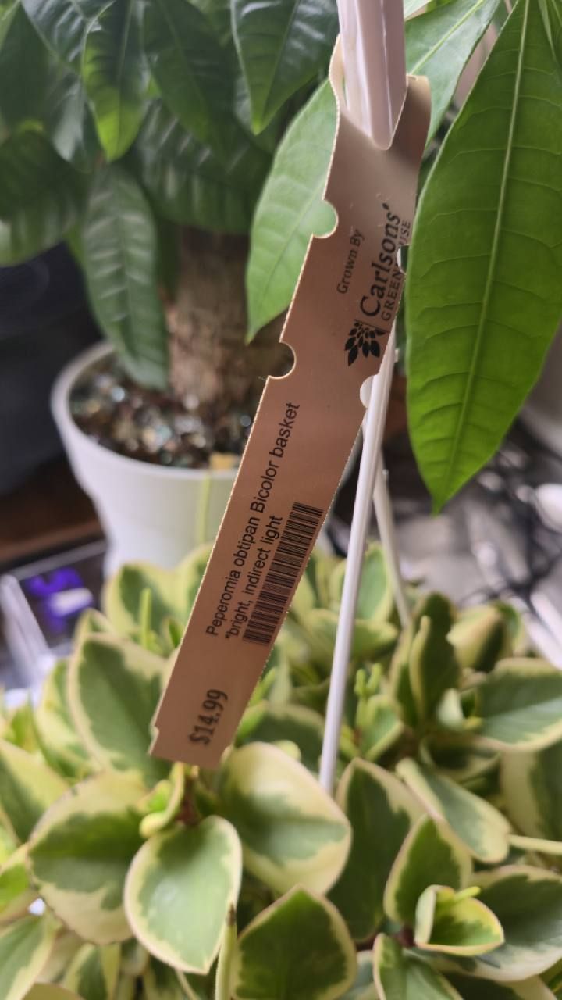

# Peperomia Bicolor

- Inventory: Houseplant-03 — _Peperomia obtusifolia_ 'Obtipan Bicolor'
- Label ID: `#7`
- Tracker ID: `P31`
- Visual description: A compact, branching houseplant with thick, rounded green leaves and broad cream-colored variegation; the photographed purchase is in a hanging nursery basket.
- Interesting fact: The breeder's patent describes 'Obtipan' as a cross between two unnamed _Peperomia obtusifolia_ cultivars, not a cross between different species. The RHS separately lists the variegated name 'Obtipan Bicolor'.
- Identification: **seller-labeled “Peperomia obtipan Bicolor”; consistent with the RHS-listed _Peperomia obtusifolia_ 'Obtipan Bicolor', with cultivar identity based on nursery provenance**
- Acquired from: Carlson's Greenhouses; direct purchase confirmed by the owner
- Acquired on: 2026-09-20
- Current pot: six-inch nursery pot (owner-reported)

## Names and identity

| Kind                   | Name                                      |
| ---------------------- | ----------------------------------------- |
| Working cultivar       | _Peperomia obtusifolia_ 'Obtipan Bicolor' |
| Collection common name | Peperomia Bicolor                         |
| Exact nursery wording  | “Peperomia obtipan Bicolor basket”        |
| Species common names   | Baby rubber plant; blunt-leaved peperomia |

The nursery name is consistent with the RHS cultivar record. Preserve that provenance rather than promoting the photograph alone to cultivar proof. The species is _Peperomia obtusifolia_; “obtipan” on the tag is a cultivar-name element, not a species epithet.

The USPP29598P3 breeder record documents green-leaved 'Obtipan' and its two _P. obtusifolia_ parents. That establishes the ancestry of 'Obtipan', but does not by itself establish the exact origin, release date, or patent coverage of this Bicolor plant. No interspecific parentage is asserted here.

## Purchase and label evidence

The owner confirmed buying this plant directly at Carlson's Greenhouses on September 20, 2026, in its nursery pot, now reported by the owner as six inches in diameter. The tag also identifies Carlson's Greenhouses as the grower. The photographed grower tag reads “Peperomia obtipan Bicolor basket”, “bright, indirect light”, and **$14.99**. The basket in the acquisition photograph is purchase-container evidence only. No completed repot, weight, or root-zone watering observation has been supplied. The owner reports the nursery pot is currently on the floor on the room side near the money tree. The separate Amazon Basics eight-inch drainage pot and floor-stool arrangement remain planned.

At the owner's explicit request on September 20, this plant uses **P31 / #7 / Houseplant-03**. The abandoned Amazon research has no physical-label or tracker allocation.

## Last confirmed floor placement and planned pots

Both current nursery pots are owner-reported as six inches in diameter. The owner reports both nursery pots are quite full and thinks the plants are ready for larger pots. The owner confirms two Amazon Basics eight-inch destination pots with many drainage holes, one previously decorated, and plans to use them on separate floor pot stools, explicitly off the tables; the ordered Bamworld Nature three-pack is recorded in the [equipment inventory](../../equipment/inventory.md#display-and-support), with receipt, stool assignment, and measured heights still unconfirmed. The proposed medium combines loose greenhouse-supplied potting mix, described by the owner as airy and containing perlite, with Molly's Succulent Mix. More perlite is available, but no ratio or completed blend is recorded. The owner confirmed on September 20, 2026 that both nursery pots are already on the floor on the room side near the money tree. The eight-inch repots and move onto stools remain future plans. Exact spacing, leaf-height light, and current nursery-pot depth, drainage, and medium remain unmeasured or unrecorded.

One destination pot is the previously decorated pot; its specific plant assignment is unconfirmed. Plans do not create a Water, Repot, move, or weight observation.

### September 21 living-room plan

The owner plans to move this plant and **P32 / #8 Tricolor oyster plant** to a **north-facing living-room window**, using the **FECiDA 54 W six-tube clip light purchased September 21 alongside both owned 10 W LED bars and the separate owned 10 W LED light**. The [equipment inventory](../../equipment/inventory.md#lights-and-controls) records the exact listing and September 23 delivery estimate. This is a separate destination from Money Tree's recorded windowsill in the cactus room. Receipt, the move, and installation remain pending; existing lamp models, final settings, distances, and canopy coverage are unrecorded. See the [living-room measurement trial](../../layouts/table-placement-research.md#planned-living-room-window-and-leds).

Bright indirect light remains the goal. NC State's statement that the species tolerates low light for several months is qualified as especially applicable to non-variegated cultivars; it does not establish an ideal exposure for Bicolor. Measure the combined light at the actual leaves and judge subsequent growth when adjusting the setup.

## Origin and form

NC State describes _P. obtusifolia_ as a tropical American perennial with thick, succulent-like foliage. Its compact leaf form does not make it a desert cactus: the species is intolerant of both persistently wet and very dry soil. The named cultivar has a horticultural origin; do not give it a separate wild native range.

## Care in this collection

On September 20, 2026, the owner reported ambient conditions of approximately **45–50% relative humidity** and temperatures **in the 70s °F**. These are approximate room conditions, not a measured minimum/maximum record or a reading at this specific root zone. The nursery supplied no watering or fertilizer history. Wet leaves were observed at purchase, but that does not establish whether the root ball had been watered or fertilized.

| Topic                      | Practical approach                                                                                                                                                                                                                                                                                                                                                                                                    |
| -------------------------- | --------------------------------------------------------------------------------------------------------------------------------------------------------------------------------------------------------------------------------------------------------------------------------------------------------------------------------------------------------------------------------------------------------------------- |
| Light                      | Bright indirect light, consistent with the nursery label and extension guidance. Keep the cream-variegated leaves out of an abrupt move into the strongest cactus exposure.                                                                                                                                                                                                                                           |
| Proposed starting exposure | **About 4–6 mol·m⁻²·day⁻¹ initially**, with **6–10** a possible settled comparison range if new growth remains compact and undamaged. These are conservative collection-specific trial ranges inferred from bright-indirect guidance, not measured cultivar thresholds or an established optimum.                                                                                                                     |
| Grow-light position        | **Last confirmed September 20 on the room-side floor near the money tree.** The September 21 plan is the living-room north window with the new FECiDA and all three existing LED lights; move and installation remain pending. Stool choice, clearances, applied settings, and leaf-height exposure are unmeasured. The cactus-table readings do not establish exposure at either position.                           |
| Water                      | RHS recommends allowing the mix to partially dry between waterings. Check the upper mix and accessible root zone while avoiding prolonged whole-pot drought. A wet root zone, even under a dry surface, is a reason to wait. Check current nursery-pot drainage, water through when needed, and empty retained runoff.                                                                                                |
| Tracker                    | Treat this as a manual moisture-check houseplant. A pot weight can document a trend, but a cactus plateau or prior dry reference alone cannot decide watering. Establish actual setup and observation records before relying on learned timing.                                                                                                                                                                       |
| Pot and medium             | The owner plans a separate **Amazon Basics eight-inch pot with many drainage holes**, with no completed repot reported. Current nursery-pot diameter is owner-reported as **six inches**; depth, drainage, medium, and root condition remain unrecorded. The proposed greenhouse-mix/Molly's blend has no chosen ratio; keep destination drainage holes clear and inspect the root ball before implementing the plan. |
| Temperature and airflow    | Keep in a warm indoor position away from cold glass or drafts, with gentle moving air rather than a continuous direct fan blast.                                                                                                                                                                                                                                                                                      |
| Feeding                    | Establish root health, current nursery feed, and ordinary drying first; purchase alone is not a reason to fertilize. Use the collection's documented dilution only when feeding is actually appropriate.                                                                                                                                                                                                              |

For the proposed living-room trial, 4–6 DLI over a constant **12-hour** light period is approximately **93–139 µmol·m⁻²·s⁻¹**. The FECiDA's listed **12-hour timer** is the proposed first daytime trial, with the other lights aligned where their controls allow; no setting has been reported applied. The DLI comparison includes lamps plus daylight, so these PPFD equivalents are not an extra LED quota on top of window light. Compare estimates with **all four fixtures on together after dark** across the foliage, and assess variable daylight separately; a single noon reading multiplied by the timer is not a measured daily integral. Acclimate gradually and judge new growth; neither the starting nor the optional settled range establishes a minimum, optimum, or burn threshold. The old cactus-room timer and room conditions do not measure the planned living-room exposure.

## Watch points and propagation

- Check the undersides, leaf axils, stems, and basket before placing the new plant among the established collection.
- Persistently wet mix, soft stems, or declining roots need inspection. A soft leaf alone does not distinguish thirst from root damage.
- Pale or scorched patches after a move warrant reassessing exposure; elongated, weak new growth can warrant a gradual increase after root and moisture checks.
- NC State describes propagation by stem or leaf cuttings. Establish the purchased plant first; exact variegation retention is not guaranteed here from species-level propagation guidance.

## Sources

- Owner plan and purchase screenshot on September 21, 2026: move P31/P32 to a living-room north-facing window and use the newly purchased FECiDA six-tube light **with both existing 10 W bars and the separate 10 W light**. The [equipment record](../../equipment/inventory.md#lights-and-controls) cites the exact seller listing, timer choices, and estimated arrival; receipt, final settings/distances, installation, and completed move remain unconfirmed.
- [Iowa State Extension: supplemental-light considerations](https://yardandgarden.extension.iastate.edu/how-to/growing-indoor-plants-under-supplemental-lights/important-considerations-providing-supplemental-light-indoor-plants) and [University of Minnesota Extension: indoor lighting](https://extension.umn.edu/garden-and-home/yard-and-garden/gardening-in-minnesota/lighting-for-indoor-plants): generic foliage DLI categories, PPFD conversion, and suggested light duration. The collection's Bicolor ranges remain an inference, not published cultivar thresholds.

- Owner clarification on September 20, 2026: direct Carlson's purchase in owner-reported six-inch nursery pots; the owner reports both nursery pots are quite full and ready for larger pots; two Amazon Basics eight-inch destination pots with many drainage holes confirmed by the owner, one decorated; off-table floor stools planned; loose greenhouse mix described as airy with perlite, Molly's and additional perlite available, ratio undecided. Both pots are currently on the floor on the room side near the money tree; no completed repot or move onto the planned stools is reported. Nursery watering/fertilizer history was not supplied; wet leaves do not establish root-ball watering or feeding. The owner reports roughly 45–50% RH and temperatures in the 70s °F, without measured extrema.

- [Owner's September 20, 2026 acquisition photograph with Carlson's Greenhouses grower tag](../../../assets/nursery-labels/2026-09-20-p33-peperomia-obtipan-bicolor-acquisition.jpg) and purchase confirmation: purchase date, exact nursery wording, bright-indirect instruction, displayed $14.99 price, and purchase basket.
- [RHS: _Peperomia obtusifolia_ 'Obtipan Bicolor'](https://www.rhs.org.uk/plants/379773/peperomia-obtusifolia-obtipan-bicolor-v/details): recognized horticultural name and cultivar record.
- [USPP29598P3: Peperomia plant named 'Obtipan'](https://patents.google.com/patent/USPP29598P3/en): breeder account, same-species parents, and distinction from an unsupported interspecific-hybrid claim.
- [NC State Extension: _Peperomia obtusifolia_](https://plants.ces.ncsu.edu/plants/peperomia-obtusifolia/): tropical origin, form, bright indirect light, sensitivity to wet and very dry soil, and propagation.
- [RHS: How to grow peperomia](https://www.rhs.org.uk/plants/peperomia/how-to-grow-peperomia): partial drying between waterings and condition-led watering.
