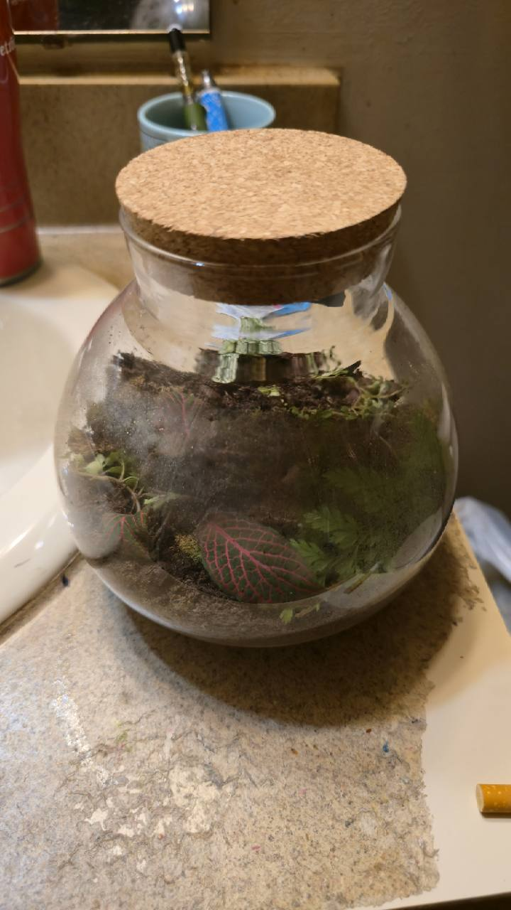
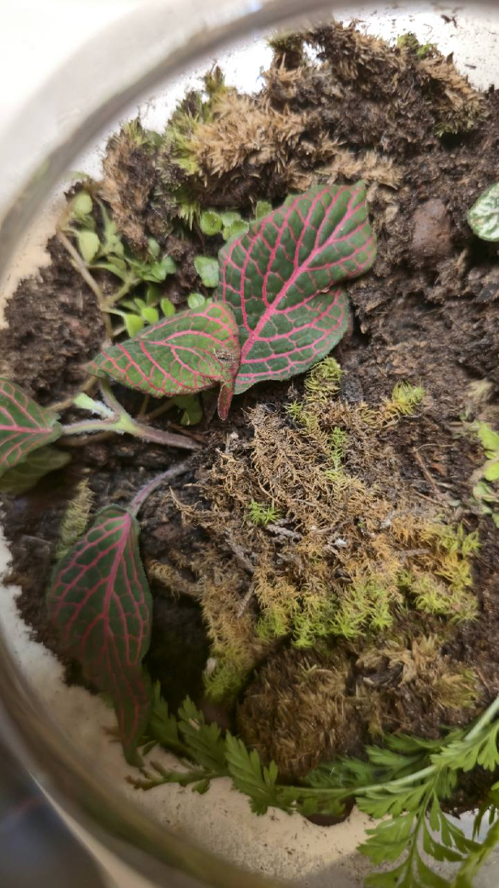
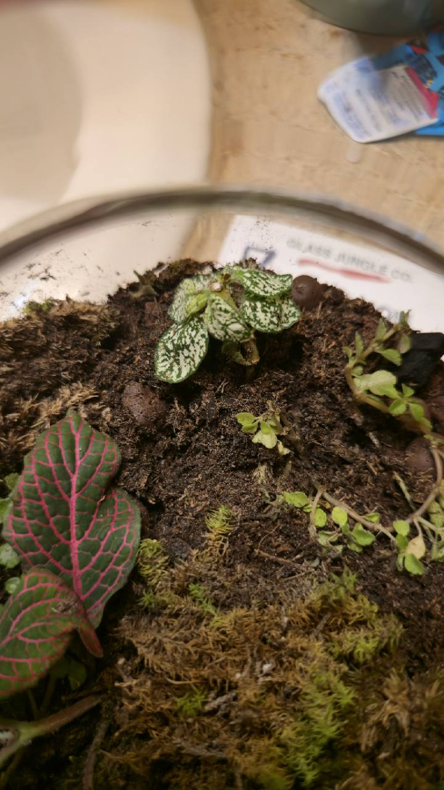
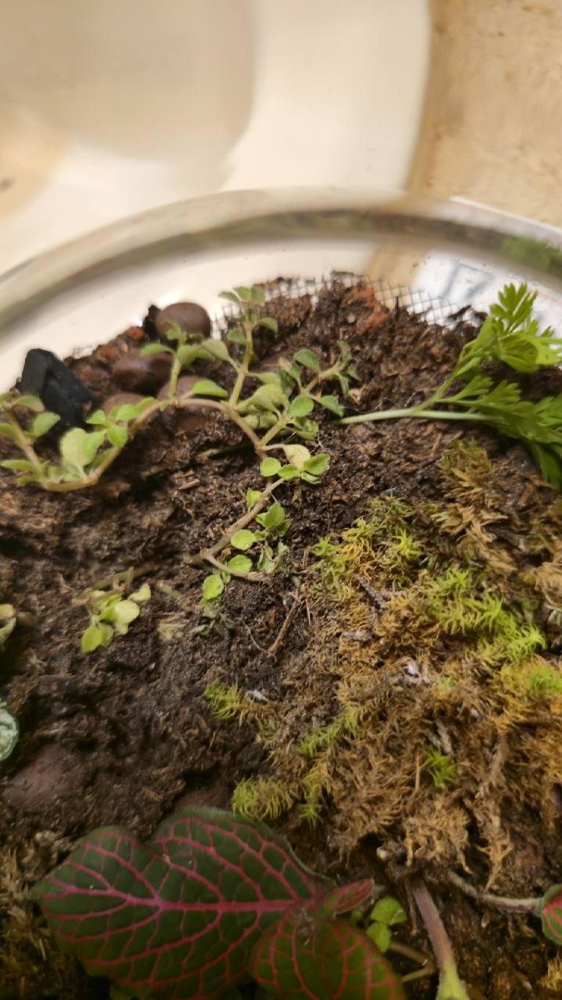
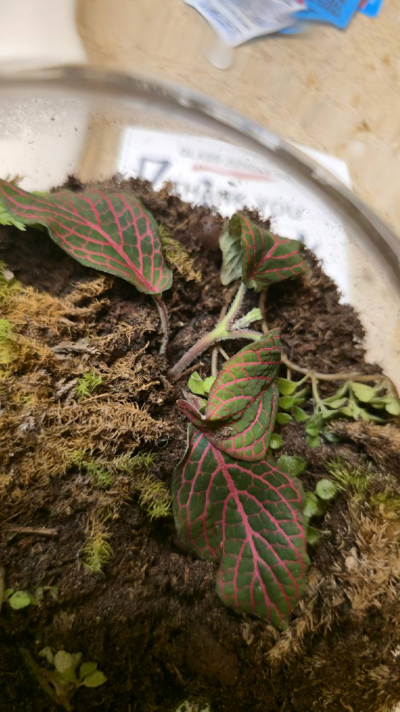

# Terrarium

- Inventory: Houseplant-05 — mixed terrarium; provisional plant identifications
- Label ID: `#12`
- Tracker ID: `P38`
- Status: Active aggregate profile; one mixed houseplant container with provisional botanical identities
- Visual description: Rounded glass jar with a cork lid, red-veined green leaves, white-speckled foliage, small trailing stems, divided fern-like foliage, and brown-and-green moss; the arrival photographs show flattened and displaced growth after shipping.
- Interesting fact: A closed terrarium recirculates moisture, so condensation and high air humidity do not by themselves establish whether its root zone needs water.
- Identification: **Probable Fittonia albivenis and Hypoestes phyllostachya; tentative Pilea cf. depressa; fern-like foliage and moss unidentified. Cultivars unknown. These are photo-based comparisons, not seller-confirmed species.**
- Acquired from: Seller identity unrecorded; made-to-order terrarium listing supplied by owner
- Acquired on: Exact delivery date unconfirmed; enrolled 2026-10-09; arrival-condition photographs supplied 2026-10-10
- Current pot: Cork-lidded glass jar; seller-listed 6.3 × 3.9 in (16 × 10 cm), dimension orientation unverified; substrate recipe, internal depth, and drainage unconfirmed

## Names and identity

| Visible group                          | Working identification                     | Confidence                                  |
| -------------------------------------- | ------------------------------------------ | ------------------------------------------- |
| Red-veined green foliage               | _Fittonia albivenis_, nerve plant          | Probable; cultivar unknown                  |
| White-speckled green foliage           | _Hypoestes phyllostachya_, polka-dot plant | Probable; cultivar unknown                  |
| Small rounded leaves on trailing stems | _Pilea_ cf. _depressa_                     | Tentative comparison; low confidence        |
| Divided green foliage                  | Unidentified fern-like planting            | Insufficient diagnostic views               |
| Brown and green surface mat            | Unidentified moss                          | Species and brown-area viability unresolved |

The netted veins and hairy stems support the Fittonia comparison; the irregular
white spotting supports Hypoestes. The small trailing leaves resemble the RHS
description of _Pilea depressa_, but close views of leaves and nodes are needed.
No named fern or moss species can be supported from the supplied views.

The seller describes variable live moss, small terrarium plants, natural
hardscape, and substrate, with no species list. The whole jar is **Houseplant-05
/ P38 / #12** under Houseplants. This is an aggregate overview, not one verified
species or five botanical member records. Keep one care and weight history.

## Arrival and enclosure evidence

Five owner photographs supplied October 10, 2026 document the jar after
shipping. The owner reports damage; the seller expects recovery, but no recovery
time or root-health conclusion is verified. The complete
[arrival record](../../terrarium.md#arrival-photographs) preserves all five views,
the shipping report, and identification details. Owner photographs remain
copyright Nick, all rights reserved, separate from licensed reference images.

The visible diagnostic clues are above the substrate: leaf veins, spotting,
shape, and stem habit. None of these views exposes roots or establishes which
stems share a root system; surface moss condition does not reveal the moisture
or health of the underlying root zone.

The seller lists **6.3 × 3.9 in (16 × 10 cm)**. The dimension orientation is
unverified; these are seller figures, not measured height, diameter, substrate
depth, or root volume. Dark medium, moss, round brown pieces, and a mesh edge are
visible; a drainage outlet or water reservoir is not established.

The owner reports a shelf near, but not close to, the cactus grow area and about
**9,000 lux outside the glass on the light-facing side**. Reducing that reading
to about **7,000 lux** is proposed, not a completed move or a plant threshold.
Leaf-level light, lamp identity, distance, and duration are unrecorded.

A mini sensor hanging below the cap reportedly read **99% RH with fogged glass**
on October 10. Model, reading time, and temperature are unknown. The seller's
**90% RH** suggestion is retained as seller advice, not a verified care target.

## Practical care for this jar

| Area                 | Starting practice                                                                                                                                                                                     |
| -------------------- | ----------------------------------------------------------------------------------------------------------------------------------------------------------------------------------------------------- |
| Light                | Bright indirect light; keep the glass out of direct sun and away from heat. Check leaf-level exposure and warming before changing the nearby light arrangement.                                       |
| Water                | Inspect the medium and any standing water first. Do not add water solely for shipping wilt, brown moss, or an RH reading; avoid a fixed watering schedule or cactus dry-down rule.                    |
| Lid and condensation | Seller care says keep the lid closed. If condensation stays heavy or dripping, briefly vent or wipe the glass and reassess, following RHS guidance. The owner's usual lid routine remains unrecorded. |
| Recovery             | Remove clearly dead loose debris carefully, preserve living stems, and compare new photographs for posture and new growth. Recovery time is unknown.                                                  |
| Records              | Record humidity in % RH for P38, with time and sensor position. Weigh the same complete assembly consistently; components do not get separate weigh-ins.                                              |

The seller also says to mist only when needed. No water volume, fertilizer dose,
daily venting task, or fixed humidity target has been established for this jar.
Confirm moisture before any addition; persistent fogging alone is not proof of
water pooling below the substrate.

## Watch points

- Inspect flattened foliage for changes rather than diagnosing rot or pests from
  its arrival posture alone.
- Keep new decay, lasting heavy condensation, warming, and actual standing water
  distinct observations; each calls for checking the enclosure.
- Obtain clearer leaves and nodes for the trailing plant, a whole frond and its
  underside for the fern-like growth, and close moss shoots before refining IDs.
- Record actual setup changes when they occur. Recording the seller's jar size
  does not mean the planting was repotted.

## Sources

- [Owner arrival record and photographs](../../terrarium.md), supplied October 10,
  2026: shipping condition, provisional identifications, reported placement,
  external-glass lux, and under-cap RH. Capture and delivery times are unconfirmed.
- Seller listing text supplied by the owner October 10, 2026: 6.3 × 3.9 in
  (16 × 10 cm), cork lid, variable planting and hardscape, and care advice.
  Seller identity and listing URL were not supplied; no independent product
  verification or species confirmation is claimed.
- [NC State Extension: _Fittonia albivenis_](https://plants.ces.ncsu.edu/plants/fittonia-albivenis/) — foliage and stem features supporting the probable comparison.
- [NC State Extension: _Hypoestes phyllostachya_](https://plants.ces.ncsu.edu/plants/hypoestes-phyllostachya/) — spotted foliage supporting the probable comparison.
- [RHS: How to grow pilea](https://www.rhs.org.uk/plants/pilea/how-to-grow-pilea) — rounded leaves and cascading habit of _Pilea depressa_, used only as a tentative comparison.
- [RHS: Terrariums and bottle gardens](https://www.rhs.org.uk/plants/types/houseplants/bottle-gardens-and-terrariums) — indirect light, moisture retention, sparing watering, condensation management, and dead-material removal.
