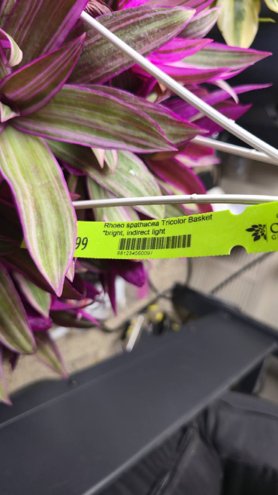

# Tricolor oyster plant

- Inventory: Houseplant-04 — _Tradescantia spathacea_ 'Tricolor'
- Label ID: `#8`
- Tracker ID: `P32`
- Visual description: Compact rosettes of upright, pointed, strap-shaped leaves striped green and cream with pink tones and purple undersides; the photographed purchase is in a hanging nursery basket.
- Interesting fact: The old nursery genus name _Rhoeo_ survives on this tag, while Kew accepts the species as _Tradescantia spathacea_. Its small flowers sit inside boat-shaped bracts, the origin of the common name oyster plant.
- Identification: **seller-labeled “Rhoeo spathacea Tricolor”; consistent with variegated _Tradescantia spathacea_, with cultivar identity based on nursery provenance**
- Acquired from: Carlson's Greenhouses; direct purchase confirmed by the owner
- Acquired on: 2026-09-20
- Current pot: six-inch nursery pot (owner-reported)

## Names and identity

| Kind                        | Name                                |
| --------------------------- | ----------------------------------- |
| Accepted species            | _Tradescantia spathacea_ Sw.        |
| Collection cultivar wording | _Tradescantia spathacea_ 'Tricolor' |
| Exact nursery wording       | “Rhoeo spathacea Tricolor Basket”   |
| Collection common name      | Tricolor oyster plant               |
| Other species common names  | Boat lily; Moses-in-the-cradle      |

Kew accepts _Tradescantia spathacea_, and NC State records _Rhoeo spathacea_ among its synonyms. Preserve the nursery's 'Tricolor' wording so the record remains traceable to the acquired plant. The specialist cultivar register Tradescantia Hub treats 'Tricolor' as an established synonym of 'Sitara'; that is a nomenclatural cross-reference, not an independent authentication of this individual plant.

This rosette-forming species is distinct from the unreceived 'Nanouk' in the abandoned Amazon order. At the owner's explicit request on September 20, it uses **P32 / #8 / Houseplant-04**. Archived Houseplant-02 retains its botanical research identity, with no physical-label or tracker allocation.

## Purchase and label evidence

The owner confirmed buying this plant directly at Carlson's Greenhouses on September 20, 2026, in its nursery pot, now reported by the owner as six inches in diameter. The tag also identifies Carlson's Greenhouses as the grower. The photographed grower tag reads “Rhoeo spathacea Tricolor Basket” and “bright, indirect light”. No price is confirmed for this plant. The basket establishes the purchase presentation; the six-inch diameter comes from the owner. Current nursery-pot depth, medium, drainage configuration, weight, and root-zone watering observations remain to be recorded. The owner reports the nursery pot is currently on the floor on the room side near the money tree. A separate Amazon Basics eight-inch drainage pot and floor stool are planned; no completed repot or move onto a stool is reported.

## Current floor placement and planned pots

Both current nursery pots are owner-reported as six inches in diameter. The owner reports both nursery pots are quite full and thinks the plants are ready for larger pots. The owner confirms two Amazon Basics eight-inch destination pots with many drainage holes, one previously decorated, and plans to use them on separate floor pot stools, explicitly off the tables; the stools are being purchased/on order, with model and height unrecorded. The proposed medium combines loose greenhouse-supplied potting mix, described by the owner as airy and containing perlite, with Molly's Succulent Mix. More perlite is available, but no ratio or completed blend is recorded. The owner confirmed on September 20, 2026 that both nursery pots are already on the floor on the room side near the money tree. The eight-inch repots and move onto stools remain future plans. Exact spacing, leaf-height light, and current nursery-pot depth, drainage, and medium remain unmeasured or unrecorded.

One destination pot is the previously decorated pot; its specific plant assignment is unconfirmed. Plans do not create a Water, Repot, move, or weight observation.

## Origin, publication, and form

Kew records the species as first published in **1788** and native from southern Mexico to Guatemala. The cultivated variegated form has no separate wild native range. NC State describes a clumping tropical perennial with purple-backed foliage and small white flowers enclosed by boat-shaped bracts. It can spread outdoors in suitable climates; this collection record is for an indoor container.

## Care in this collection

On September 20, 2026, the owner reported ambient conditions of approximately **45–50% relative humidity** and temperatures **in the 70s °F**. These are approximate room conditions, not a measured minimum/maximum record or a reading at this specific root zone. The nursery supplied no watering or fertilizer history. Wet leaves were observed at purchase, but that does not establish whether the root ball had been watered or fertilized.

| Topic                      | Practical approach                                                                                                                                                                                                                                                                                                                                                                                                                           |
| -------------------------- | -------------------------------------------------------------------------------------------------------------------------------------------------------------------------------------------------------------------------------------------------------------------------------------------------------------------------------------------------------------------------------------------------------------------------------------------- |
| Light                      | Bright indirect light, as printed on the nursery tag and described by NC State. Increase exposure gradually after purchase; foliage color does not establish tolerance of the strongest cactus position.                                                                                                                                                                                                                                     |
| Proposed starting exposure | **About 6–8 mol·m⁻²·day⁻¹ initially**, with **8–12** a possible settled comparison range if new growth remains compact and undamaged. These are conservative collection-specific trial ranges inferred from bright-indirect guidance, not measured cultivar thresholds or an established optimum.                                                                                                                                            |
| Grow-light position        | **Currently on the floor, room side near the money tree, off the tables.** Owner-confirmed September 20, 2026. A floor pot stool is still planned; its height, exact clearance, and leaf-height exposure are unmeasured. The far-table **18–22 app-estimated DLI** does not measure this floor position. Keep the existing cactus arrangement intact.                                                                                        |
| Water                      | NC State advises letting the upper **1–2 inches** dry between waterings in a well-drained medium. Scale the physical check to the actual basket/root ball once measured; do not wait for prolonged cactus-style whole-pot drought. Inspect moisture below a dry surface before watering.                                                                                                                                                     |
| Tracker                    | Use a manual upper-mix and plant-condition check. Weight trends are supporting observations; neither a plateau nor a model date proves readiness. Establish actual setup and observations before relying on learned timing.                                                                                                                                                                                                                  |
| Pot and medium             | The owner plans a separate **Amazon Basics eight-inch pot with many drainage holes**, with no completed repot reported. Keep the destination drainage holes clear and inspect the nursery root ball before implementing the plan. Current nursery-pot diameter is owner-reported as **six inches**; depth and medium remain unrecorded; the proposed greenhouse-mix/Molly's blend has no chosen ratio. Empty retained runoff after watering. |
| Temperature and airflow    | Keep warm, away from cold glass and drafts, with gentle airflow that does not constantly bend or dry the leaves.                                                                                                                                                                                                                                                                                                                             |
| Feeding                    | Confirm the nursery medium/feed and allow ordinary drying before deciding on fertilizer. The purchase date is not a feeding trigger.                                                                                                                                                                                                                                                                                                         |
| Handling                   | Sap may irritate skin, and the plant is unsuitable for chewing by pets or people. Wear gloves when cutting or dividing, and keep cuttings and sap out of reach.                                                                                                                                                                                                                                                                              |

For comparison with the owner's app, 6–8 DLI over a constant 13-hour day is approximately **128–171 µmol·m⁻²·s⁻¹**. The actual 13 h 15 m lighting program includes ramps, so this conversion is a comparison aid rather than a measured daily integral. Evaluate leaf-height readings and subsequent growth before increasing exposure; no upper trial number is a proven burn threshold.

## Watch points and propagation

- Inspect leaf bases, undersides, and the basket for pests before integrating it with the established collection.
- Soft bases or persistently wet medium call for root-zone inspection. Dry tips or drooping leaves alone do not distinguish excess light, inconsistent moisture, drafts, or root trouble.
- Avoid leaving water pooled around the crowded leaf bases, and preserve airflow without using a harsh fan stream.
- NC State describes division, stem cuttings, and seed propagation. Division or offsets can wait until the purchased plant is established; use gloves because of irritating sap.

## Sources

- Owner clarification on September 20, 2026: direct Carlson's purchase in owner-reported six-inch nursery pots; the owner reports both nursery pots are quite full and ready for larger pots; two Amazon Basics eight-inch destination pots with many drainage holes confirmed by the owner, one decorated; off-table floor stools planned; loose greenhouse mix described as airy with perlite, Molly's and additional perlite available, ratio undecided. Both pots are currently on the floor on the room side near the money tree; no completed repot or move onto the planned stools is reported. Nursery watering/fertilizer history was not supplied; wet leaves do not establish root-ball watering or feeding. The owner reports roughly 45–50% RH and temperatures in the 70s °F, without measured extrema.

- [Owner's September 20, 2026 acquisition photograph with Carlson's Greenhouses grower tag](../../../assets/nursery-labels/2026-09-20-p34-tradescantia-spathacea-tricolor-acquisition.jpg) and purchase confirmation: exact nursery wording, bright-indirect instruction, purchase date, and purchase basket.
- [Kew Plants of the World Online: _Tradescantia spathacea_](https://powo.science.kew.org/taxon/173471-1): accepted species, native range, and first publication.
- [NC State Extension: _Tradescantia spathacea_](https://plants.ces.ncsu.edu/plants/tradescantia-spathacea/): synonyms, growth form, light, upper-mix drying, drainage, propagation, and handling risks.
- [Tradescantia Hub cultivar register: 'Sitara'](https://tradescantia.uk/cultivar/tra-sitara/): specialist register's 'Tricolor' synonym cross-reference; retained separately from this plant's nursery provenance.
